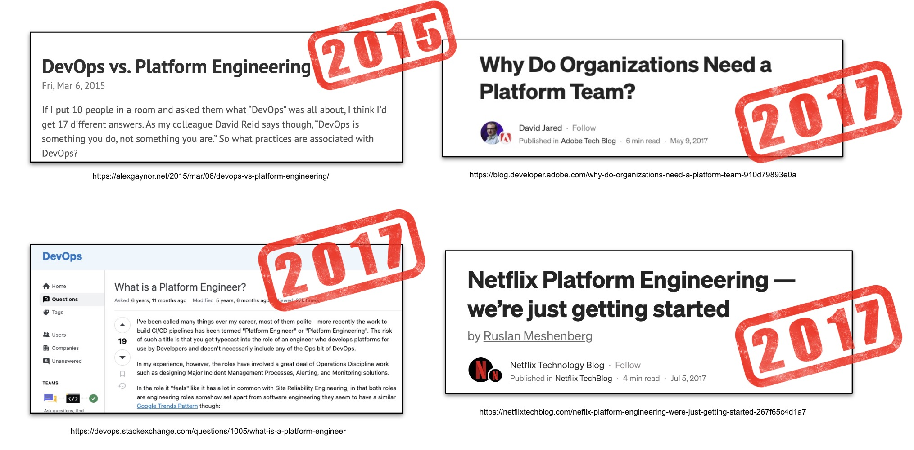
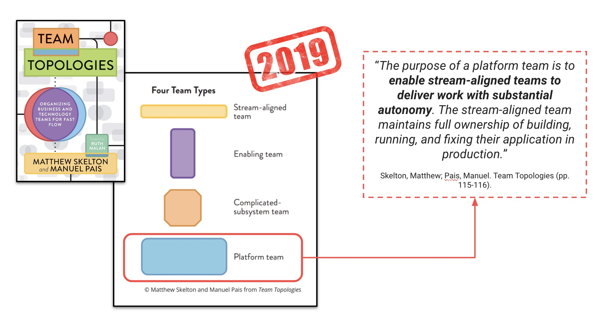
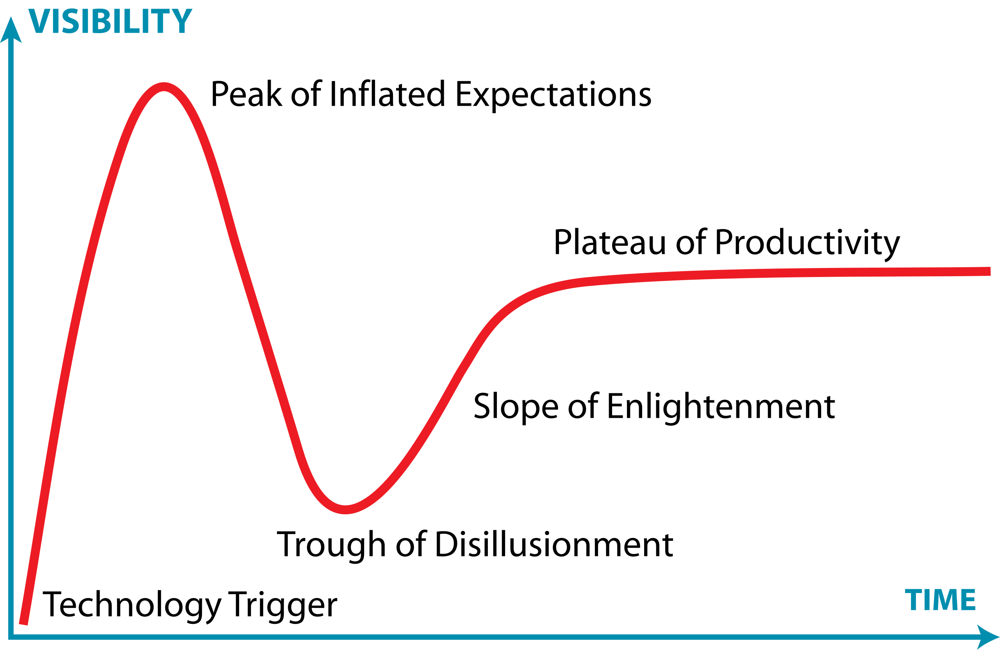

**(WIP)**

In the last Commit Conf, 2024, I had the pleasure to give a talk about Platform Engineering. If you are interested in watching it, it's available in [Youtube](https://www.youtube.com/watch?v=SAeFqfqy0JM)

The talk is in spanish so, in this post I'm going to try to summarize, in english, what I was talking in that talk about **Plaform Engineering**

# This is someting new

The first thing you need to know is that **Platform Engineering isn't something new**. For sure, if you have many years of experience in IT, you'll find that many of the terms and practices (now) associated with Platform Engineering are familiar to you or you may have even implemented some of them without knowing that they had trendy names. 

Actually, many years ago, about 2015, Platform Engineering already exists and you can find discussions about the practice or the difference with DevOps:

ThoughtWorks included Platform Engineering in the [volume number 16 of its Technology Radar](https://www.thoughtworks.com/content/dam/thoughtworks/documents/radar/2017/03/tr_technology_radar_vol_16_en.pdf), talking about Platform engineering product teams: 

> The adoption of cloud and DevOps, while increasing the productivity of teams who can now move more quickly with reduced dependency on centralized operations teams and infrastructure, also has constrained teams who lack the skills to self-manage a full application and operations stack. Some organizations have tackled this challenge by creating **PLATFORM ENGINEERING PRODUCT TEAMS**. **These teams operate an internal platform which enables delivery teams to self-service deploy and operate systems with reduced lead time and stack complexity**. The emphasis here is on API-driven self-service and supporting tools, with delivery teams still responsible for supporting what they deploy onto the platform. Organizations that consider establishing such a platform team should be very cautious not to accidentally create a separate DevOps team, nor should they simply relabel their existing hosting and operations structure as a platform.
>

In that radar, ThoughtWorks already advised that, when we implement a platform engineering model, we need to be careful not to create a new silo ("a separate DevOps team"). We'll come back to this later in the post.

But, the term Platform Engineering has reached its most popularity because of the well known book "Team Topologies" from 2019

So, if Platform Engineering isn't something new, why is it so popular these days and everyone is talking about it in many of the principal conferences around the world? In fact, there is a conference fully dedicated to platform engineering: [PlatformCon](https://platformcon.com/)

# Platform Engineering is everywhere...Why?

Today, the term "Platform Engineering" appears in every conference, in many books, articles and more. In my opinion, there are two main reasons for this:

- The superficial and commercial one: hype
- The genuine need: the increasing complexity of software

### The (current) hype

When we talk about hype, in many scenarios we can associate it with "doing business" (or the intention of that). In others, we'll just find the developers curiosity trying new shiny things. In my opinion, nowdays Platform Engineering is strongly associated with the first kind of scenario (there is nothing wrong in this).

Let's explain it a little bit more starting for introducing "[the Gartner hype cycle](https://www.gartner.com/en/research/methodologies/gartner-hype-cycle)"? 

In the graph above, we observe five steps of phases. Initially, **there is a trigger** that starts everything and makes people and companies talk about that by publicity, marketing, etc...

**Then, a peak of hype (or inflated expectations) is reached**. That means that a lot of people and companies are trying to adopt the new shiny thing (because is what they always have needed). **Gartner says that some of then will get success but many others will fail.** We can find many reasons for those failures. In my opinion: poor maturity and the need for doing what others do (without thinking about that) are the main ones.

The next step is **disillusionment**. Those failures make companies to stop the initiatives and re-evaluate that technology or methodology in order to determine is it was what the company has always needed and if it's true, think carefully how to implement it and wait for next levels of maturity.

From this point, in many cases, **things start to work causing a enlightenment phase and the mainstream adoption starts to take off**.

 says that:

> “*By 2026,* **80% of large software engineering organizations will establish platform engineering teams** *as internal providers of reusable services, components and tools for application delivery*”

 

So, I hope you liked it, whether you agree or not with my vision. That's all folks.
